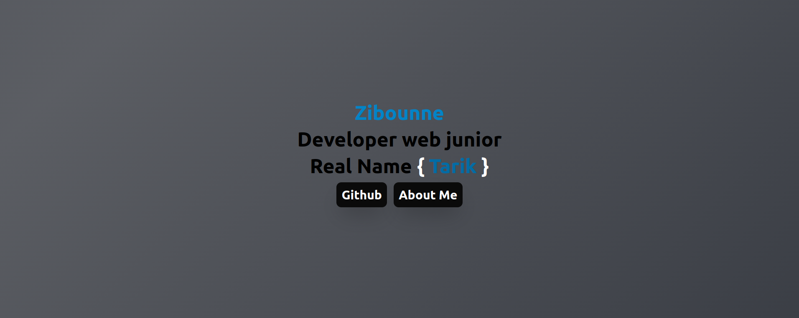

# 📌 Portfolio

🔹 Welcome to my **portfolio**! Here, I share my various **development projects**, whether they involve **algorithmic** explorations, **programming experiments**, or **complete applications**. This space serves as both a **showcase** and a personal reference, as well as a way to **share** my work with other enthusiasts.

## 📷 Screenshot

## 🛠️ Technologies

📟 Front-End: Angular / Sass

## 👤 Author

📝 Name : **Tarik Dahhane**
 
📝 Pseudo : **Zibounne**
 
🌍 Portfolio : [https://zibounne.github.io/Portfolio/](https://zibounne.github.io/Portfolio/)

### ⭐ Credits

📟 Coding Time | Portfolio
 

 

    
